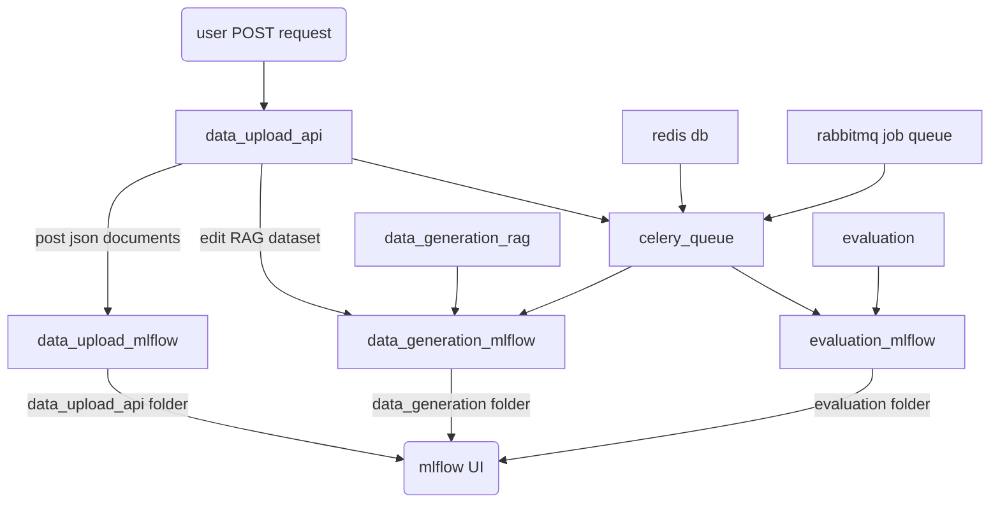

# llm-eval
Code to generate synthetic data and then allow LLMs to score against the data

# Steps
## Setup
1. Add mlflow to path (if there is a warning it is not on path)
2. Create `.env` file and specify port to host the ui on
3. Start MLFlow server:
`mlflow ui` (production)
`mlflow ui --dev --port=PORT` (development)
4. Start json post api server:
    - `flask --app data_upload_api run --port=PORT --debug` in dev
    - In production, run `gunicorn -w 4 -b 127.0.0.1:$(UPLOAD_PORT) 'data_upload_api:app'`
5. Start rabbitMQ job queue: `docker run -d -p 5672:5672 rabbitmq`
6. Start Redis to store results: `docker run -d --name redis-stack-server -p 6379:6379 redis/redis-stack-server:latest`
7. Start celery server to manage the queue: `celery -A celery_queue.celery_app worker --loglevel=INFO`

## POST data to server
1. Post data (check out sample at `api_tests_sample.rest`)
    - It takes a json file with the json contents in the body
    - You can specify file-name in the header as a `file-name` field
    - `window-size` refers to how many input chunks are used together per context window
    - `window-step` refers to how many chunks ahead the window reads, and is the step size of the rolling window. For example, if `window-size` = 4 and `window-step` = 2, the first chunk will group chunks 1-4, and second will group chunks 3-6. If `window-step` = 1, the second chunk will group chunks 2-5 instead. If we have 17 chunks with `window-size` = 4 and `window-step` = 2, in the last chunk it will be chunks 15-17. `window-step` will be prioritised over maintaining `window-size` per grouped chunk.
2. View results at the mlflow ui spun up above

## POST new synthetic data to server
1. `curl` example provided at `api_tests_sample.rest`. You can find run_id from the MLFlow UI. If no run_id is provided, the API assumes you want to upload it in a new run in `data_generation` folder.
2. View results at the same mlflow ui.

## nginx sample
```
server {
    listen outside_port;
    listen [::]:outside_port;
    
    server_name domain.name.or.IP;

    location / {
        include proxy_params;
        proxy_pass http://127.0.0.1:$(UPLOAD_PORT);
        proxy_set_header X-Forwarded-For $proxy_add_x_forwarded_for;
    }
}
```

Expose the outside_port via ufw or other on the host machine. Create two different setups for the mlflow front-end and also the json api post server.

# Things to note
1. Deleting experiments from the front-end won't delete the actual data or actual run, it will still be in mlrun and mlartifacts folders.
2. With te way mlflow.log_artifact works, you'll actually save 2 copies of the generated csv input:
```
Log a local file or directory as an artifact of the currently active run. If no run is active, this method will create a new active run.
```
So that means 1 master copy and 1 copy in the artifacts folder.

# .env format
```
OPENAI_API_KEY=
ANYSCALE_KEY=
PORT=
UPLOAD_FOLDER=
DATAGEN_UPLOAD_FOLDER=
UPLOAD_PORT=
SESSION_TYPE=
FLASK_KEY=
```

# Detailed documentation
## Infrastructure



## Explanation of files
1. `data_upload_api.py` - powers the flask api to listen to POST requests, and sends commands to other files
2. `data_upload_mlflow.py` - adds the POST request into MLFlow UI
3. `data_generation_rag.py` - processes the input csv document to generate synthetic data, and transform to required output format
4. `data_generation_mlflow.py` - start experiment on MLFlow UI, triggers synthetic data generation, shows results on the UI
5. `celery_queue.py` - Celery job queue to manage subtasks separately from data upload
6. `evaluation.py` - a script to evaluate models against the generated RAG data
7. `evaluation_mlflow.py` - start experiment on MLFlow UI, triggers evaluation, shows results on the UI

## Future work
1. Find a better way to manage files and filenames